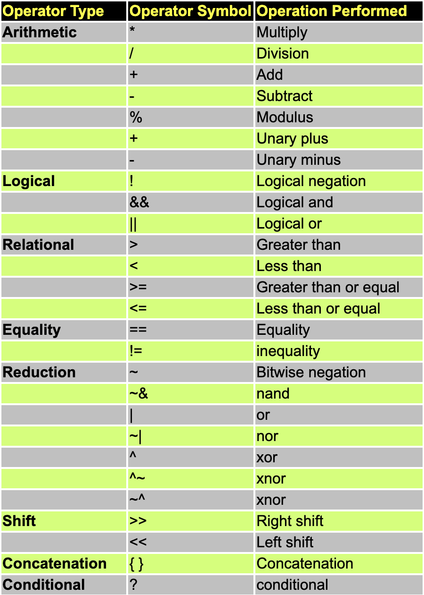
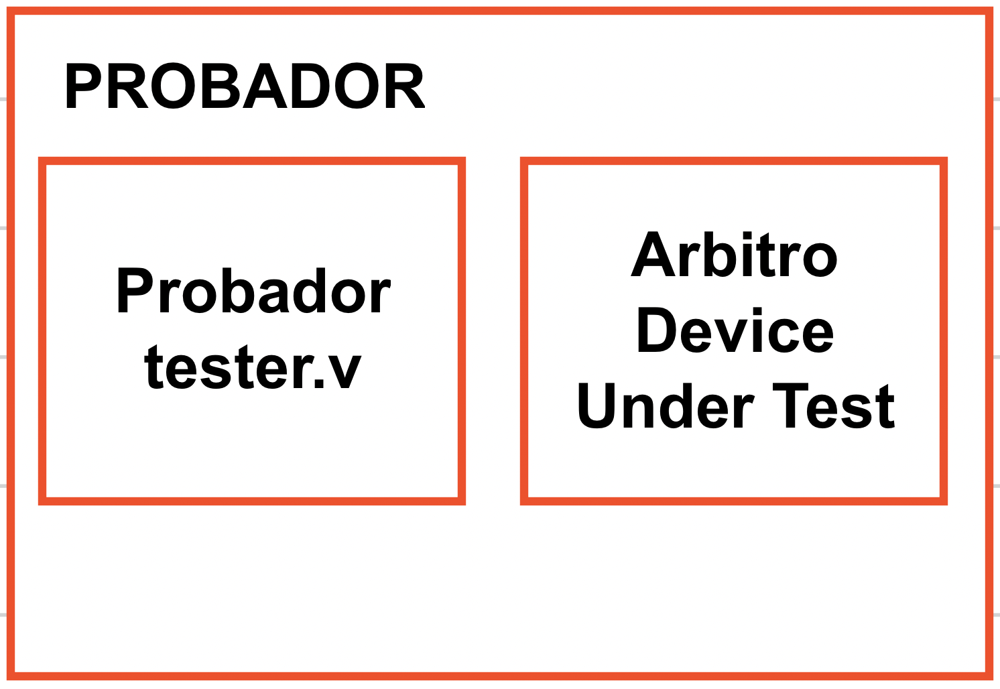

# Apuntes intro a Verilog

- Data types en Verilog: 
    - wire: solo tiene output 
    ```Verilog
        wire and_gate_output;  
    ```
    - reg: tiene memoria    
    ```Verilog
    reg [7:0] adress_bus;
    ```





### Ejemplo en clase: 

```Verilog
input [63:0] balance_inicial; 
output [63:0] balance_final; 
// Negacion 
(!balance_inicial); // Retorna True o False nada más en este caso si hay algo en balance_inicial va a devoler True
(balance_inicial && balance_final); // Y lógica A and B, los va a tener como 1 y 1 enotnces va a dar 1 

//Operadores relacionales, Bitwise (bit por bit)

intput [3:0] digito; 
digito = 4'b0010
~digito // el resultado seria 4'b1101

//Ahora:
prueba = 4'b1101; 

(digito & prueba); // da como resultado 4'b0010

(digito | prueba); //Da como resultado 4'b1110
```

- ``<=`` Se puede utilizar para asignaciones no bloqueantes o para "menor o igual que". 


El comando que venga con ``$algo`` no es sintetizable. No se puede convertir en ningún tipo de compuerta. Se utilizan para la simulación, por ejemplo: ``$display`` para imprimri cosas mientras se simula. 


- Always, siempre tiene que tener una condición que indica cuándo es que se va a ejecutar, por eso se le asigna el ``@(condiciones o eventos)``. Si pongo un ``*`` en los paréntesis significa "Siempre que pase algo". 

    - El always que tiene solo ``posedege`` o ``negedge`` se comvierte en flipflops. En estos casos utilizamos por ejemplo: 
    ```Verilog 
    always  @ (posedge clk )
    if (reset == 0) begin
    y <= 0;
    end else if (sel == 0) begin
    y <= a;
    end else begin
    y <= b;
    end  
    ```
    * Utilizamos ``<=`` para asignación no bloqueante. 

- Utilizamos un ``#numero`` para generar un retardo


```Verilog 
always begin 
    #5 clk =~ clk; 
end 
```


- Se puede utilizar ``repeat (#de veces que quiero que algo se repita)``. 

- Bloque de ``initial``, no son sintetizables. Se pone normalmente en el *probrador*

    - ```Verilog 
        initial begin 
        //condiciones 
        end
        ```

- ``posedge`` -> Flanco positivo
- ``negedge`` -> Flanco negativo del relog 

- ``assign out = (enable) ? data : 1'bz;`` Es un "tri-state buffer", cuando enable es 1 la salida es data sino se manda a high-z.

- ``assign out = data;`` se utiliza como un simple buffer. 

- Los ``assing`` se pueden utilizar para colocar variables intermedias, se tiene que poner fuera de los ``always`` y despues los puedo utilizar dentro de estos.

-----------------------------------
# Clase 29 Agosto

- Se estará utilizando los programas del apartado de Ejemplo_Arbitro para ver todo lo que es la estructura de los programas que se deben tener. 



- Si tengo elementos y solo los pongo como input u output se van a tomar por defecto como *wire*
- Normalmente, como las salidad se manejan como *reg*, elementos almacenadores de memoria, donde se sostiene ese valor hasta que halla un cambio. 
- Los wires son solo para acciones en las que debo recibir algo, por eso se le asignan a las entradas. Son valores que yo no puedo modificar. 

------------

#### Sobre la estructura

- Lo que sale del probador va a ser la entrada del controlador/arbitro o programa. 
- Las salidas de mi programa lógico pueden ser las entradas del probador para utilizarlas y manejar algunos datos o información de algún tipo de comportamiento específico. 

*SUPER IMPORTANTE*
- Agregar ``#numero $finish``
- Los comandos que empiezan con *$* no son sintetizables, simplemente son instrucciones.

