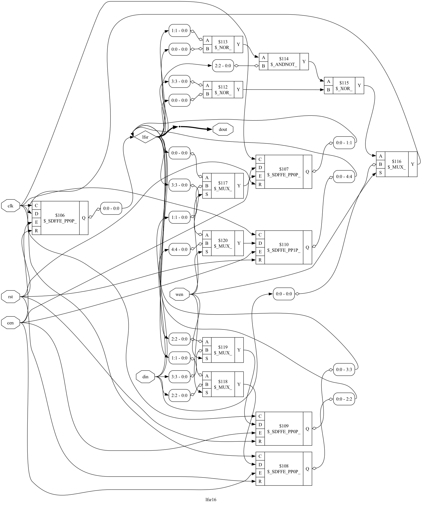

# Pruebas de ejecución e instalación del software para el curso

---------------------------------
### Instalación del Sorftware

- No se presentó mayor complicación al tener un OS basado en Unix como lo es MacOS es bastante facil realizar dicha instalación, se realizó con *Homebrew*. 

--------------------
### Ejecución de las pruebas 

```bash 
# Compilación:
iverilog -o prueba.out Prueba_Verilog_GTKwave.v
# Ejecución 
vvp prueba.out 
# visualizar ondas con GTKwave
gtkwave lfsr16.vcd
```
-----------------
### Resultados


- Al ejecutar el archivo *.out* se obtiene:

```bash 
VCD info: dumpfile lfsr16.vcd opened for output.
xxxxx
10000
00001
00011
00111
01111
11110
11101
11010
10101
01011
10110
01100
11001
10010
00100
01000
10000
00001
00011
00111
01111
11110
11101
11010
10101
01011
10110
01100
11001
10010
00100
01000
10000
Prueba_Verilog_GTKwave.v:105: $finish called at 380 (1s)
```


- Al ejecutar el archivo *.vcd*:


- Al utilizar Yosys:

```bash 
yosys
read_verilog Prueba_Yosys.v
synth 
show
```

Se obtiene el siguiente gráfico generado con las conecciones:


