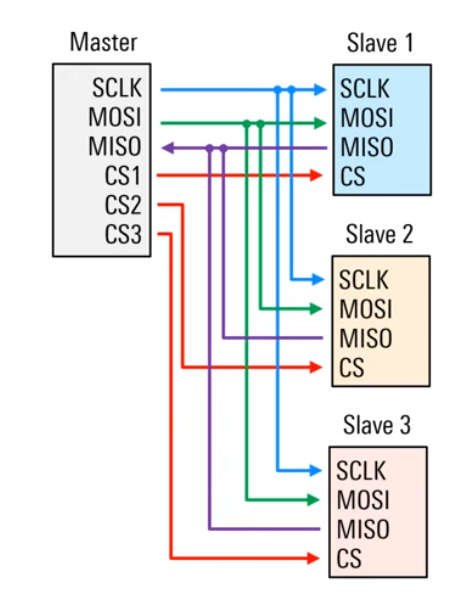
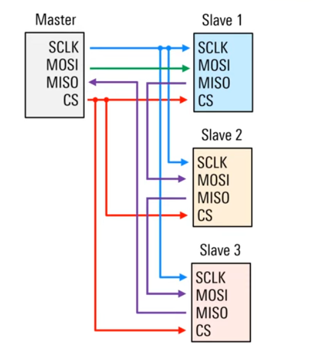

# Protocols Summary 

---------
# I2C

#### Brief data 

- For short distance data communication 
- Synchronous master-slave protocol 
  - Both master and slave can send/revceive data
- Just 2 wires are used (SCL & SDA)

 #### Behavior 

- IDLE state SDA and SCL are both high
- *Start Condition* occures when a node: 
  - First pulls SDA low
  - Then pulls SCL low
- This claims the bus 
  - Node is now the master 
  - Prevents any other nodes from taking control of the bus 
  - Reduces risk of contention 
- Master that has sized the bus also starts the clock 

- Each I2C node on a bus must have a unique, fixed address
  - Normaly 7 bits long, MSB first
  - 10 bits addresses also supported, but these are uncommon 
- Adresses may be hard coded
- adress may be (partially) configurable via external address lines or jumpers

#### Timing relationship between SDA and SCL 
- SDA does not change between clock rising edge and clock falling edge 
- During *data transmission*, SDA onli tansitions while SCL is *low*
  - An SDA transition when SCL is *hich*, indicates a *start or stop* condition. 

#### READ/WRITE bit 

- Read/Write bit follos the slave address
- Set by master to indicate desired operation 
  - 0 -> master wants to write data to slave 
  - 1 -> master whats to read data to slave 
- Often interpreted and/or decoded as part of the addres byte 

#### Acknowledge bit (ACK)

- Sent by the receiver of a byte of data
  - 0-> acknowledgement (ACK)
  - 1-> negative acknowledge (NACK)
- Recall that I2C is IDLE high
  - Lack of response = NACK
- ACK after data byte(s) confirms receipt of data
- ACK after slave address confirms that
  - A slave with that addres is on the bus 
  - the slave is ready to read/write data (sepending on R/W bit)
  
#### Data Byte(s)
- Data byte contains the information being transferred between master an slave 
  - Memory or register contents, address, etc.
-  Always 8 bit long. MSB first. 
-  Always followed by an ACK bit 
   -  Set to 0 by the reciever if data has been recieved properly

####  Multiple data bytes 

- In many cases, multiple data bytes are sent in one I2C frame 
  - Each data byte is followed by an ACK bit
- Biyes may be all "data" or some may represent an internal address, etc.
  - Ex: first byte is a register location and second byte is the thada to be written to that register
  
#### Stop condition 

- Stop condition indicates the end of data bytes 
  - First SCL returns (and remains) high 
  - Then, SDA returns (and remains) high 
- Recall that for *data* bytes, SDA only transitions when clock is *low*
  - SDA transitions when SCL *High = stop condition*
- Bus becomes IDLE 
  - No clock signal 
  - Any node can now use the start condition to claim the bus and begin a new communication 

#### Open drain 

- Each line (SDA and SDL) is connected to voltage ($V_{cc}$ or $V_{DD}$) via "pull up" resistor 
  - One resistor per line (not per device)
- Each I2C device contains logic that can open an close a drain 
- When drain is "closed", the line is pulled low (connected to ground)
- WHen drain is "open", the line is pulled high (connected to voltage)
- I2C lines are high in the IDLE state
  - Sometimes called an "open drain" system 
  
#### Pull up resistor values 

- Pulling down a line is usually much faster than pulling up a line 
  - Pull-up time is a function of bus capacitance and values of pull-up resistors 
- Values of pull-up resistors are a compromise 
  - *Higher resistances* increase the time needed to pull up the line and thus *limit bus speed*
  - *Lower resistances* allow faster communications, but *require higher power*
- Typicall pull-up resistor values are in the range of $1k\Omega - 10k\Omega$
  
#### Modes/Speed

- I2C Can operate at different bus speeds 
  - Referred to as "modes"
- Table shows max speed for each mode 
    - Hardware is specified as compliant to standart, fast, or fast plus if it can (theoretically) achieve these speeds
- *High speed mode* devices are backwards compatible to lower speeds
  - Transmit a special sequence to switch the bus to HS mode
- *Ultra fast mode* is unidirectional (write only)
  
| I2C Mode          | Speed     |
|--------------------|-----------|
| Standard Mode      | 100 kbps  |
| Fast Mode          | 400 kbps  |
| Fast Mode Plus     | 1 Mbps    |
| High Speed Mode    | 3.4 Mbps  |
| Ultra Fast Mode    | 5 Mbps    |

---
# SPI

Four wire serial interface 
- Speed improvement over UART / $I^2C$
- Supports full-duplex communications

Verry loosely "definied"
- Often used for data transfer between a (smart) conttroller and a (less smart) peripheral device. 
  - Common applications include sensors, displays, ADC/DAC, RTC, game controllers, and so on. 

#### Basic SPi components / nomenclature 

- One master(can be called controller) an one or more slaves (can be called peripherals)
  - Up to 4 wires between them
- *CS*
  - Chis select (to interact with the chosen peripheral)
- *SCLK*: Synchronous Clock
  - Provides timing / synchronization 
- *MOSI*
  - Master out Slave in: Data transmitted by master
- *MISO*
  - Master in Slave out: Data reveived for these 
  

#### Overview of SPI protocol
- CS (commonly in 1) gets pulled down to 0 so the slave knows theres data incomming, then SCLK starts working and data is sent or recieved. At the end CS $\rightarrow$ 1. 

##### About CS 
- Its commonly called "Slave Select" (SS). 
- Tipically active low, hence the overbar (CS). 
- Pulled low to select the target for communication  
  - Slave then listens to SCLK and MOSI 
  - Kept low unitl communication is complete
- Simple way to address targets 
  - unlike $I^2C$ which uses address
- A sinlge or multiple CS lines can be used to address multiple devices
##### About SCLK 
- Clock signal is generated by the master 
  - Slaves dont require their own cloks, even when they are transmitting data
- Speed usually into the MHz range 
  - Faster than UART or $I^2C$
- Clock indicates when data should be sampled 
  - When to read voltage levels 
  - One bit is read per clock signal 
- Clock can be idle low o idle high 
- Data can be smapled on rising or falling edge 
  
##### About MOSI 
- Used to send data from master to slave(s)
  - Data is usually sent as bytes (LSB or MSB firts)
- Number of bytes depends on implementation 
  - Multiple bytes can be sent sequentially 
  - CS may be held low between bytes
##### About MISO

- Used to send data from slave(s) to master
- Not all SPI implementatios use MISO 
  - Some devices only recieve data from master
- MISO sent as a response to data on MOSI
  - Commands, queries, etc. 
- Master MUST KNOW how many clock cycles to generate so the slave can send all of its data 
  - May be known in advance or slave may be qeried for this information 
  
#### About SPI topics 

##### CPOL (Clock polarity)
We gonna have: 
$\rightarrow$ Leading (first) edge 
$\rightarrow$ Trailing (second) edge

- Active in High $\rightarrow$ CPOL = 0 (non-inverted)
 
- Active in Low $\rightarrow$ CPOL = 1 (inverted)

#### CPHA (clock phase)

- SPI recievers may sample data on either leading of trailing clock edge 
  - This is called clock phase (CPHA)

- CPHA = 0 $\rightarrow$  Data sampled on leading (or first) edge of each clock pulse
 
- CPHA = 1 $\rightarrow$ Data sampled on trailing (or second) edge of each clock pulse 

#### SPI modes 

- Four possible combinbations of CPOL and CPHA
  - Often summarized as a SPI mode number (0-3) 
- All SPI nodes must use the same mode 
  - May be fixed or configurable 
- Mode can often be determined by inspection 

|Mode         | CPOL     |          CPHA     |
|--------------------|-----------|-----------|
| 0      | 0 |0  |
| 1         | 0  | 1  |
| 2    | 1    |0    |
| 3   | 1  | 1 |

#### Multi-slave configuration 
##### independent slaves (Not that good)
One way a master can communicate with several slaves is having multiple CS line, for each slave

##### Cooperative Slaves / Daisy Chain (More complicated and not accepted in all SPI products)
Theres just one CS and SCLK signal for all the slaves and one MOSI (conected to the first slave), the MISO signal from the slave 1 is conected to slave 2 and so on. And the last MISO signal from the last slave is conected to de MISO of the master 

