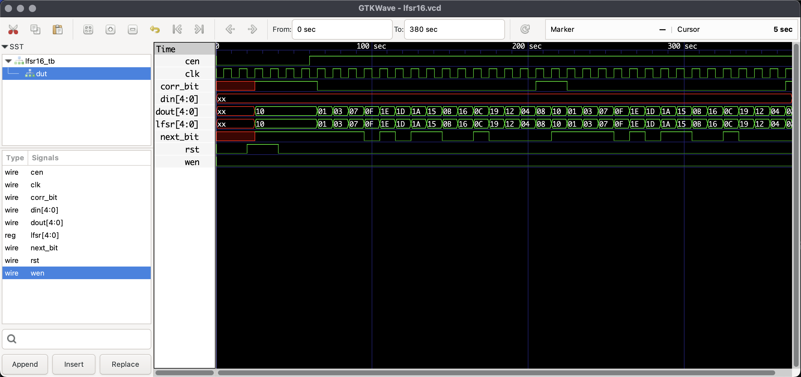

# Pruebas de ejecución e instalación del software para el curso

---------------------------------
### Instalación del Sorftware

- No se presentó mayor complicación al tener un OS basado en Unix como lo es MacOS es bastante facil realizar dicha instalación, se realizó con *Homebrew*. 

--------------------
### Ejecución de las pruebas 

```bash 
# Compilación:
iverilog -o prueba.out Prueba_Verilog_GTKwave.v
# Ejecución 
vvp prueba.out 
# visualizar ondas con GTKwave
gtkwave lfsr16.vcd
```
-----------------
### Resultados


- Al ejecutar el archivo *.out* se obtiene:

```bash 
VCD info: dumpfile lfsr16.vcd opened for output.
xxxxx
10000
00001
00011
00111
01111
11110
11101
11010
10101
01011
10110
01100
11001
10010
00100
01000
10000
00001
00011
00111
01111
11110
11101
11010
10101
01011
10110
01100
11001
10010
00100
01000
10000
Prueba_Verilog_GTKwave.v:105: $finish called at 380 (1s)
```


- Al ejecutar el archivo *.vcd*:




- Al utilizar Yosys:

```bash
roiri-> yosys -p "read_verilog Prueba_Yosys.v; synth; show"


 /----------------------------------------------------------------------------\
 |  yosys -- Yosys Open SYnthesis Suite                                       |
 |  Copyright (C) 2012 - 2025  Claire Xenia Wolf <claire@yosyshq.com>         |
 |  Distributed under an ISC-like license, type "license" to see terms        |
 \----------------------------------------------------------------------------/
 Yosys 0.56 (git sha1 9c447ad9d4b1ea589369364eea38b4d70da2c599, clang++ 17.0.0 -fPIC -O3)

-- Running command `read_verilog Prueba_Yosys.v; synth; show' --

1. Executing Verilog-2005 frontend: Prueba_Yosys.v
Parsing Verilog input from `Prueba_Yosys.v' to AST representation.
Generating RTLIL representation for module `\lfsr16'.
Successfully finished Verilog frontend.

2. Executing SYNTH pass.

2.1. Executing HIERARCHY pass (managing design hierarchy).

2.2. Executing PROC pass (convert processes to netlists).

2.2.1. Executing PROC_CLEAN pass (remove empty switches from decision trees).
Cleaned up 0 empty switches.

2.2.2. Executing PROC_RMDEAD pass (remove dead branches from decision trees).
Marked 2 switch rules as full_case in process $proc$Prueba_Yosys.v:53$5 in module lfsr16.
Removed a total of 0 dead cases.

2.2.3. Executing PROC_PRUNE pass (remove redundant assignments in processes).
Removed 0 redundant assignments.
Promoted 0 assignments to connections.

2.2.4. Executing PROC_INIT pass (extract init attributes).

2.2.5. Executing PROC_ARST pass (detect async resets in processes).

2.2.6. Executing PROC_ROM pass (convert switches to ROMs).
Converted 0 switches.
<suppressed ~3 debug messages>

2.2.7. Executing PROC_MUX pass (convert decision trees to multiplexers).
Creating decoders for process `\lfsr16.$proc$Prueba_Yosys.v:53$5'.
     1/1: $0\lfsr[4:0]

2.2.8. Executing PROC_DLATCH pass (convert process syncs to latches).

2.2.9. Executing PROC_DFF pass (convert process syncs to FFs).
Creating register for signal `\lfsr16.\lfsr' using process `\lfsr16.$proc$Prueba_Yosys.v:53$5'.
  created $dff cell `$procdff$14' with positive edge clock.

2.2.10. Executing PROC_MEMWR pass (convert process memory writes to cells).

2.2.11. Executing PROC_CLEAN pass (remove empty switches from decision trees).
Found and cleaned up 3 empty switches in `\lfsr16.$proc$Prueba_Yosys.v:53$5'.
Removing empty process `lfsr16.$proc$Prueba_Yosys.v:53$5'.
Cleaned up 3 empty switches.

2.2.12. Executing OPT_EXPR pass (perform const folding).
Optimizing module lfsr16.

2.3. Executing OPT_EXPR pass (perform const folding).
Optimizing module lfsr16.

2.4. Executing OPT_CLEAN pass (remove unused cells and wires).
Finding unused cells or wires in module \lfsr16..
Removed 0 unused cells and 6 unused wires.
<suppressed ~1 debug messages>

2.5. Executing CHECK pass (checking for obvious problems).
Checking module lfsr16...
Found and reported 0 problems.

2.6. Executing OPT pass (performing simple optimizations).

2.6.1. Executing OPT_EXPR pass (perform const folding).
Optimizing module lfsr16.

2.6.2. Executing OPT_MERGE pass (detect identical cells).
Finding identical cells in module `\lfsr16'.
Removed a total of 0 cells.

2.6.3. Executing OPT_MUXTREE pass (detect dead branches in mux trees).
Running muxtree optimizer on module \lfsr16..
  Creating internal representation of mux trees.
  Evaluating internal representation of mux trees.
  Analyzing evaluation results.
Removed 0 multiplexer ports.
<suppressed ~1 debug messages>

2.6.4. Executing OPT_REDUCE pass (consolidate $*mux and $reduce_* inputs).
  Optimizing cells in module \lfsr16.
Performed a total of 0 changes.

2.6.5. Executing OPT_MERGE pass (detect identical cells).
Finding identical cells in module `\lfsr16'.
Removed a total of 0 cells.

2.6.6. Executing OPT_DFF pass (perform DFF optimizations).

2.6.7. Executing OPT_CLEAN pass (remove unused cells and wires).
Finding unused cells or wires in module \lfsr16..

2.6.8. Executing OPT_EXPR pass (perform const folding).
Optimizing module lfsr16.

2.6.9. Finished OPT passes. (There is nothing left to do.)

2.7. Executing FSM pass (extract and optimize FSM).

2.7.1. Executing FSM_DETECT pass (finding FSMs in design).

2.7.2. Executing FSM_EXTRACT pass (extracting FSM from design).

2.7.3. Executing FSM_OPT pass (simple optimizations of FSMs).

2.7.4. Executing OPT_CLEAN pass (remove unused cells and wires).
Finding unused cells or wires in module \lfsr16..

2.7.5. Executing FSM_OPT pass (simple optimizations of FSMs).

2.7.6. Executing FSM_RECODE pass (re-assigning FSM state encoding).

2.7.7. Executing FSM_INFO pass (dumping all available information on FSM cells).

2.7.8. Executing FSM_MAP pass (mapping FSMs to basic logic).

2.8. Executing OPT pass (performing simple optimizations).

2.8.1. Executing OPT_EXPR pass (perform const folding).
Optimizing module lfsr16.

2.8.2. Executing OPT_MERGE pass (detect identical cells).
Finding identical cells in module `\lfsr16'.
Removed a total of 0 cells.

2.8.3. Executing OPT_MUXTREE pass (detect dead branches in mux trees).
Running muxtree optimizer on module \lfsr16..
  Creating internal representation of mux trees.
  Evaluating internal representation of mux trees.
  Analyzing evaluation results.
Removed 0 multiplexer ports.
<suppressed ~1 debug messages>

2.8.4. Executing OPT_REDUCE pass (consolidate $*mux and $reduce_* inputs).
  Optimizing cells in module \lfsr16.
Performed a total of 0 changes.

2.8.5. Executing OPT_MERGE pass (detect identical cells).
Finding identical cells in module `\lfsr16'.
Removed a total of 0 cells.

2.8.6. Executing OPT_DFF pass (perform DFF optimizations).
Adding SRST signal on $procdff$14 ($dff) from module lfsr16 (D = $procmux$9_Y, Q = \lfsr, rval = 5'10000).
Adding EN signal on $auto$ff.cc:266:slice$15 ($sdff) from module lfsr16 (D = $procmux$7_Y, Q = \lfsr).

2.8.7. Executing OPT_CLEAN pass (remove unused cells and wires).
Finding unused cells or wires in module \lfsr16..
Removed 2 unused cells and 2 unused wires.
<suppressed ~3 debug messages>

2.8.8. Executing OPT_EXPR pass (perform const folding).
Optimizing module lfsr16.

2.8.9. Rerunning OPT passes. (Maybe there is more to do..)

2.8.10. Executing OPT_MUXTREE pass (detect dead branches in mux trees).
Running muxtree optimizer on module \lfsr16..
  Creating internal representation of mux trees.
  Evaluating internal representation of mux trees.
  Analyzing evaluation results.
Removed 0 multiplexer ports.
<suppressed ~1 debug messages>

2.8.11. Executing OPT_REDUCE pass (consolidate $*mux and $reduce_* inputs).
  Optimizing cells in module \lfsr16.
Performed a total of 0 changes.

2.8.12. Executing OPT_MERGE pass (detect identical cells).
Finding identical cells in module `\lfsr16'.
Removed a total of 0 cells.

2.8.13. Executing OPT_DFF pass (perform DFF optimizations).

2.8.14. Executing OPT_CLEAN pass (remove unused cells and wires).
Finding unused cells or wires in module \lfsr16..

2.8.15. Executing OPT_EXPR pass (perform const folding).
Optimizing module lfsr16.

2.8.16. Finished OPT passes. (There is nothing left to do.)

2.9. Executing WREDUCE pass (reducing word size of cells).

2.10. Executing PEEPOPT pass (run peephole optimizers).

2.11. Executing OPT_CLEAN pass (remove unused cells and wires).
Finding unused cells or wires in module \lfsr16..

2.12. Executing ALUMACC pass (create $alu and $macc cells).
Extracting $alu and $macc cells in module lfsr16:
  created 0 $alu and 0 $macc cells.

2.13. Executing SHARE pass (SAT-based resource sharing).

2.14. Executing OPT pass (performing simple optimizations).

2.14.1. Executing OPT_EXPR pass (perform const folding).
Optimizing module lfsr16.

2.14.2. Executing OPT_MERGE pass (detect identical cells).
Finding identical cells in module `\lfsr16'.
Removed a total of 0 cells.

2.14.3. Executing OPT_MUXTREE pass (detect dead branches in mux trees).
Running muxtree optimizer on module \lfsr16..
  Creating internal representation of mux trees.
  Evaluating internal representation of mux trees.
  Analyzing evaluation results.
Removed 0 multiplexer ports.
<suppressed ~1 debug messages>

2.14.4. Executing OPT_REDUCE pass (consolidate $*mux and $reduce_* inputs).
  Optimizing cells in module \lfsr16.
Performed a total of 0 changes.

2.14.5. Executing OPT_MERGE pass (detect identical cells).
Finding identical cells in module `\lfsr16'.
Removed a total of 0 cells.

2.14.6. Executing OPT_DFF pass (perform DFF optimizations).

2.14.7. Executing OPT_CLEAN pass (remove unused cells and wires).
Finding unused cells or wires in module \lfsr16..

2.14.8. Executing OPT_EXPR pass (perform const folding).
Optimizing module lfsr16.

2.14.9. Finished OPT passes. (There is nothing left to do.)

2.15. Executing MEMORY pass.

2.15.1. Executing OPT_MEM pass (optimize memories).
Performed a total of 0 transformations.

2.15.2. Executing OPT_MEM_PRIORITY pass (removing unnecessary memory write priority relations).
Performed a total of 0 transformations.

2.15.3. Executing OPT_MEM_FEEDBACK pass (finding memory read-to-write feedback paths).

2.15.4. Executing MEMORY_BMUX2ROM pass (converting muxes to ROMs).

2.15.5. Executing MEMORY_DFF pass (merging $dff cells to $memrd).

2.15.6. Executing OPT_CLEAN pass (remove unused cells and wires).
Finding unused cells or wires in module \lfsr16..

2.15.7. Executing MEMORY_SHARE pass (consolidating $memrd/$memwr cells).

2.15.8. Executing OPT_MEM_WIDEN pass (optimize memories where all ports are wide).
Performed a total of 0 transformations.

2.15.9. Executing OPT_CLEAN pass (remove unused cells and wires).
Finding unused cells or wires in module \lfsr16..

2.15.10. Executing MEMORY_COLLECT pass (generating $mem cells).

2.16. Executing OPT_CLEAN pass (remove unused cells and wires).
Finding unused cells or wires in module \lfsr16..

2.17. Executing OPT pass (performing simple optimizations).

2.17.1. Executing OPT_EXPR pass (perform const folding).
Optimizing module lfsr16.

2.17.2. Executing OPT_MERGE pass (detect identical cells).
Finding identical cells in module `\lfsr16'.
Removed a total of 0 cells.

2.17.3. Executing OPT_DFF pass (perform DFF optimizations).

2.17.4. Executing OPT_CLEAN pass (remove unused cells and wires).
Finding unused cells or wires in module \lfsr16..

2.17.5. Finished fast OPT passes.

2.18. Executing MEMORY_MAP pass (converting memories to logic and flip-flops).

2.19. Executing OPT pass (performing simple optimizations).

2.19.1. Executing OPT_EXPR pass (perform const folding).
Optimizing module lfsr16.

2.19.2. Executing OPT_MERGE pass (detect identical cells).
Finding identical cells in module `\lfsr16'.
Removed a total of 0 cells.

2.19.3. Executing OPT_MUXTREE pass (detect dead branches in mux trees).
Running muxtree optimizer on module \lfsr16..
  Creating internal representation of mux trees.
  Evaluating internal representation of mux trees.
  Analyzing evaluation results.
Removed 0 multiplexer ports.
<suppressed ~1 debug messages>

2.19.4. Executing OPT_REDUCE pass (consolidate $*mux and $reduce_* inputs).
  Optimizing cells in module \lfsr16.
Performed a total of 0 changes.

2.19.5. Executing OPT_MERGE pass (detect identical cells).
Finding identical cells in module `\lfsr16'.
Removed a total of 0 cells.

2.19.6. Executing OPT_SHARE pass.

2.19.7. Executing OPT_DFF pass (perform DFF optimizations).

2.19.8. Executing OPT_CLEAN pass (remove unused cells and wires).
Finding unused cells or wires in module \lfsr16..

2.19.9. Executing OPT_EXPR pass (perform const folding).
Optimizing module lfsr16.

2.19.10. Finished OPT passes. (There is nothing left to do.)

2.20. Executing TECHMAP pass (map to technology primitives).

2.20.1. Executing Verilog-2005 frontend: /opt/homebrew/bin/../share/yosys/techmap.v
Parsing Verilog input from `/opt/homebrew/bin/../share/yosys/techmap.v' to AST representation.
Generating RTLIL representation for module `\_90_simplemap_bool_ops'.
Generating RTLIL representation for module `\_90_simplemap_reduce_ops'.
Generating RTLIL representation for module `\_90_simplemap_logic_ops'.
Generating RTLIL representation for module `\_90_simplemap_compare_ops'.
Generating RTLIL representation for module `\_90_simplemap_various'.
Generating RTLIL representation for module `\_90_simplemap_registers'.
Generating RTLIL representation for module `\_90_shift_ops_shr_shl_sshl_sshr'.
Generating RTLIL representation for module `\_90_shift_shiftx'.
Generating RTLIL representation for module `\_90_fa'.
Generating RTLIL representation for module `\_90_lcu_brent_kung'.
Generating RTLIL representation for module `\_90_alu'.
Generating RTLIL representation for module `\_90_macc'.
Generating RTLIL representation for module `\_90_alumacc'.
Generating RTLIL representation for module `\$__div_mod_u'.
Generating RTLIL representation for module `\$__div_mod_trunc'.
Generating RTLIL representation for module `\_90_div'.
Generating RTLIL representation for module `\_90_mod'.
Generating RTLIL representation for module `\$__div_mod_floor'.
Generating RTLIL representation for module `\_90_divfloor'.
Generating RTLIL representation for module `\_90_modfloor'.
Generating RTLIL representation for module `\_90_pow'.
Generating RTLIL representation for module `\_90_pmux'.
Generating RTLIL representation for module `\_90_demux'.
Generating RTLIL representation for module `\_90_lut'.
Successfully finished Verilog frontend.

2.20.2. Continuing TECHMAP pass.
Using extmapper simplemap for cells of type $reduce_or.
Using extmapper simplemap for cells of type $logic_not.
Using extmapper simplemap for cells of type $xor.
Using extmapper simplemap for cells of type $mux.
Using extmapper simplemap for cells of type $sdffe.
No more expansions possible.
<suppressed ~81 debug messages>

2.21. Executing OPT pass (performing simple optimizations).

2.21.1. Executing OPT_EXPR pass (perform const folding).
Optimizing module lfsr16.

2.21.2. Executing OPT_MERGE pass (detect identical cells).
Finding identical cells in module `\lfsr16'.
Removed a total of 0 cells.

2.21.3. Executing OPT_DFF pass (perform DFF optimizations).

2.21.4. Executing OPT_CLEAN pass (remove unused cells and wires).
Finding unused cells or wires in module \lfsr16..
Removed 0 unused cells and 1 unused wires.
<suppressed ~1 debug messages>

2.21.5. Finished fast OPT passes.

2.22. Executing ABC pass (technology mapping using ABC).

2.22.1. Extracting gate netlist of module `\lfsr16' to `<abc-temp-dir>/input.blif'..
Extracted 10 gates and 20 wires to a netlist network with 10 inputs and 5 outputs.

2.22.1.1. Executing ABC.
Running ABC command: "<yosys-exe-dir>/yosys-abc" -s -f <abc-temp-dir>/abc.script 2>&1
ABC: ABC command line: "source <abc-temp-dir>/abc.script".
ABC: 
ABC: + read_blif <abc-temp-dir>/input.blif 
ABC: + read_library <abc-temp-dir>/stdcells.genlib 
ABC: + strash 
ABC: + dretime 
ABC: + map 
ABC: + write_blif <abc-temp-dir>/output.blif 

2.22.1.2. Re-integrating ABC results.
ABC RESULTS:            ANDNOT cells:        1
ABC RESULTS:               MUX cells:        5
ABC RESULTS:               NOR cells:        1
ABC RESULTS:               XOR cells:        2
ABC RESULTS:        internal signals:        5
ABC RESULTS:           input signals:       10
ABC RESULTS:          output signals:        5
Removing temp directory.

2.23. Executing OPT pass (performing simple optimizations).

2.23.1. Executing OPT_EXPR pass (perform const folding).
Optimizing module lfsr16.

2.23.2. Executing OPT_MERGE pass (detect identical cells).
Finding identical cells in module `\lfsr16'.
Removed a total of 0 cells.

2.23.3. Executing OPT_DFF pass (perform DFF optimizations).

2.23.4. Executing OPT_CLEAN pass (remove unused cells and wires).
Finding unused cells or wires in module \lfsr16..
Removed 0 unused cells and 16 unused wires.
<suppressed ~3 debug messages>

2.23.5. Finished fast OPT passes.

2.24. Executing HIERARCHY pass (managing design hierarchy).

2.25. Printing statistics.

=== lfsr16 ===

   Number of wires:                 16
   Number of wire bits:             28
   Number of public wires:           7
   Number of public wire bits:      19
   Number of ports:                  6
   Number of port bits:             14
   Number of memories:               0
   Number of memory bits:            0
   Number of processes:              0
   Number of cells:                 14
     $_ANDNOT_                       1
     $_MUX_                          5
     $_NOR_                          1
     $_SDFFE_PP0P_                   4
     $_SDFFE_PP1P_                   1
     $_XOR_                          2

2.26. Executing CHECK pass (checking for obvious problems).
Checking module lfsr16...
Found and reported 0 problems.

3. Generating Graphviz representation of design.
Writing dot description to `/Users/rodrigo/.yosys_show.dot'.
Dumping module lfsr16 to page 1.
Exec: ps -fu 501 | grep -q '[ ]/Users/rodrigo/.yosys_show.dot' || xdot '/Users/rodrigo/.yosys_show.dot' &

End of script. Logfile hash: 9bc3dcb08d, CPU: user 0.05s system 0.01s, MEM: 15.64 MB peak
Yosys 0.56 (git sha1 9c447ad9d4b1ea589369364eea38b4d70da2c599, clang++ 17.0.0 -fPIC -O3)
Time spent: 56% 1x abc (0 sec), 11% 14x opt_expr (0 sec), ...

```
