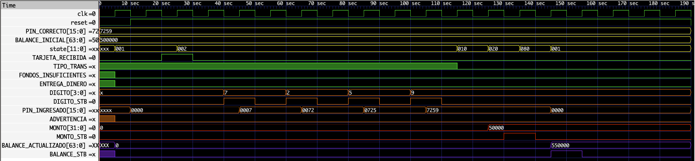
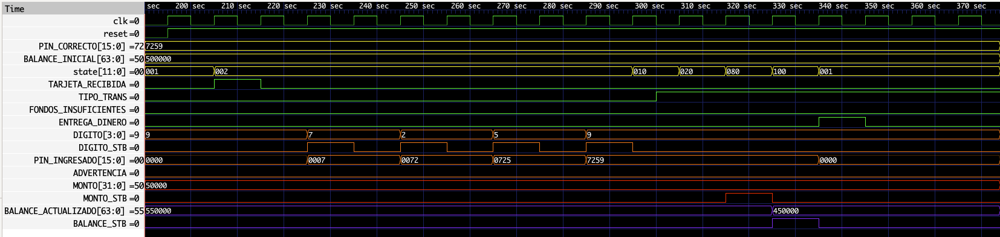
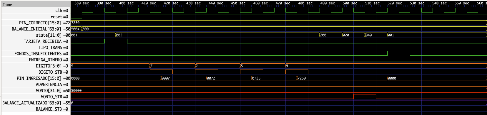
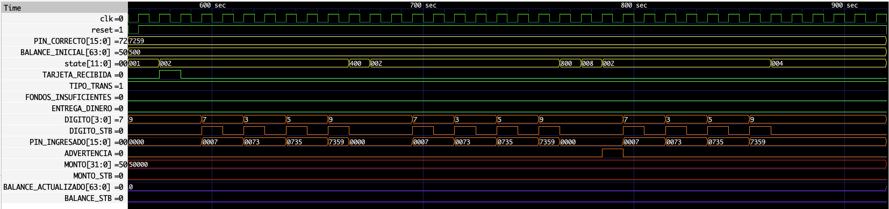

# Reporte Tarea 1

**Autor:** Rodrigo E. Sánchez Araya (C37259)  
**Profesor:** Enrique Coen Alfaro  
**Fecha:** Septiembre 2025  

---

## Resumen

En este trabajo se presenta el diseño e implementación de un controlador de cajero automático utilizando el lenguaje de descripción de hardware **Verilog**.  
El sistema propuesto permite procesar transacciones de depósito y retiro, validando correctamente las credenciales de acceso mediante un PIN y gestionando el balance de manera segura.  

El desarrollo incluyó la definición de entradas, salidas y variables internas, así como la elaboración de un diagrama ASM que describe el flujo de operación del controlador.  
Para comprobar su correcto funcionamiento, se diseñó un plan de pruebas abarcando escenarios de operación normal, condiciones de error y situaciones de reinicio forzado.  

Los resultados obtenidos mediante simulación en **GTKWave** demuestran que el controlador responde de manera adecuada a cada caso planteado, validando tanto la lógica de seguridad como la integridad en el manejo de los fondos.

---

## Descripción Arquitectónica

El controlador de cajero automático (implementado en Verilog) cuenta con:

- **10 entradas**
- **7 salidas**
- **5 variables internas**

### Entradas
- `CLK` (Señal de reloj)  
- `RESET`  
- `TARJETA_RECIBIDA`  
- `TIPO_TRANS`  
- `DIGITO_STB`  
- `DIGITO`  
- `PIN_CORRECTO`  
- `MONTO_STB`  
- `MONTO`  
- `BALANCE_INICIAL`  

### Salidas
- `BALANCE_STB`  
- `BALANCE_ACTUALIZADO`  
- `ENTREGA_DINERO`  
- `PIN_INCORRECTO`  
- `ADVERTENCIA`  
- `BLOQUEO`  
- `FONDOS_INSUFICIENTES`  

### Variables internas
- `PIN_INGRESADO`  
- `CONTADOR_PIN`  
- `STATE, NEXT_STATE`  
- `CONT_ERRORES`  
- `RESET_PREV`  

---

## Funcionalidad del Sistema

El sistema genera salidas específicas en respuesta a entradas determinadas, garantizando un funcionamiento adecuado en el control del cajero automático.

1. El proceso inicia cuando se recibe la señal `TARJETA_RECIBIDA`.  
2. Luego espera la introducción del **PIN** para compararlo con `PIN_CORRECTO`.  
   - Dos intentos fallidos → se activa `ADVERTENCIA`.  
   - Tres intentos fallidos → se activa `BLOQUEO`, del cual solo se sale con `RESET`.  

Una vez validado el PIN, se determina la operación (`TIPO_TRANS`):
- `0` → Depósito: actualiza balance.  
- `1` → Retiro: verifica fondos disponibles.  
   - Si hay saldo suficiente → actualiza balance.  
   - Si no hay saldo → `FONDOS_INSUFICIENTES`.  

Al finalizar, el sistema vuelve al estado inicial de espera de tarjeta.  

### Diagrama ASM

---

## Plan de Pruebas

1. **Prueba 1. Depósito simple**  
   Verifica operación básica de depósito.  
   **Resultado:** Exitoso ✅  

2. **Prueba 2. Retiro simple**  
   Verifica operación básica de retiro con saldo suficiente.  
   **Resultado:** Exitoso ✅  

3. **Prueba 3. Fondos insuficientes**  
   Retiro mayor al balance disponible.  
   **Resultado:** Exitoso ✅  

4. **Prueba 4. PIN incorrecto**  
   Tres intentos fallidos → activa advertencia y bloqueo.  
   **Resultado:** Exitoso ✅  

5. **Prueba 5. Depósito y retiro seguidos**  
   Verifica reinicio automático entre operaciones.  
   **Resultado:** Exitoso ✅  

6. **Prueba 6. Reinicio de `CONT_ERRORES`**  
   Confirma que los contadores internos se reinician correctamente.  
   **Resultado:** Exitoso ✅  

7. **Prueba 7. Reset forzado durante operación**  
   Garantiza recuperación segura del sistema ante interrupciones.  
   **Resultado:** Exitoso ✅  

---

## Ejemplos de Resultados

### Disposición de señales en GTKWave
- **Señales principales:** `CLK`, `RESET`.  
- **Valores estáticos:** amarillo.  
- **Señales de tarjeta y salidas:** verde.  
- **Señales de PIN:** naranja.  
- **Monto:** rojo.  
- **Balance:** violeta.  

> **Nota:** se recomienda incluir la señal `state` para verificar cambios de estado (no se añadió en las capturas para evitar saturación visual).  

---

### Resultados de pruebas

#### Prueba 1
  

#### Prueba 2
  

#### Prueba 3
  

#### Prueba 4
  

---

## Conclusiones

El desarrollo del controlador permitió comprobar la importancia de una correcta planificación en sistemas digitales, logrando un diseño **funcional, seguro y confiable**.  
Se validaron casos normales y excepcionales, como fondos insuficientes y PIN incorrecto, garantizando seguridad para el usuario.  
El mecanismo de **RESET** demostró ser clave para la recuperación del sistema.  

---

## Recomendaciones

- **Asignación de nombres:** Usar nomenclaturas claras para estados, entradas y salidas, evitando confusiones.  
- **Bitácora de cambios:** Mantener un registro de los cambios y pruebas diarias para mejorar la trazabilidad y evitar pérdida de contexto.  
